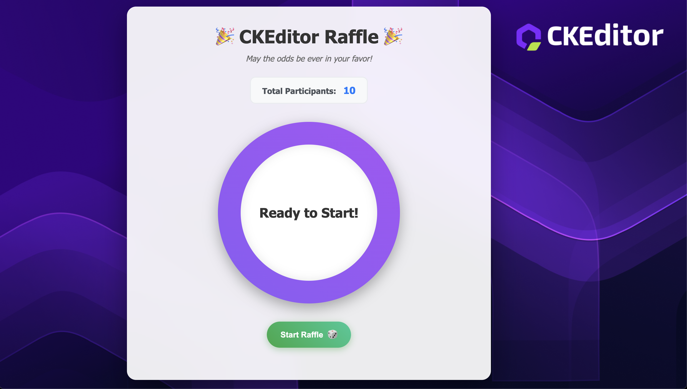
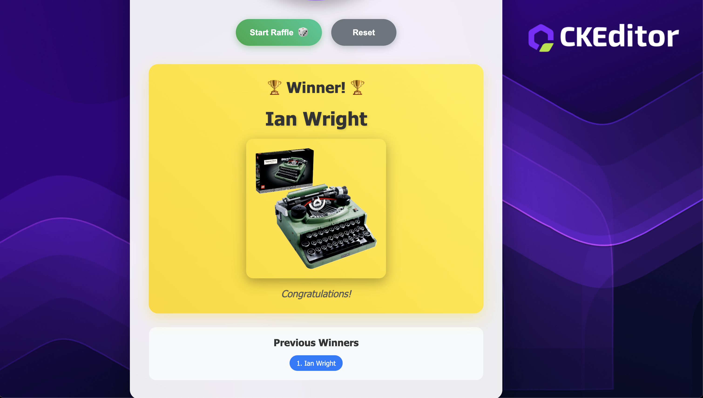

# CKEditor Raffle 🎉

A beautiful, animated web-based raffle system that reads participant names from your `names.txt` file and selects winners with smooth spinning animations.





These visuals demonstrate the smooth animations, responsive design, and celebratory winner reveal featured in the application.

## Quick Start

1. Install dependencies: `npm install`
2. Set up participant names: `npm run prepare-name` (copies sample names `names.sample.txt` to `names.txt`)
3. Edit `names.txt` to add your own participants
4. Start the development server: `npm start`
5. The raffle will automatically load names from `names.txt`
6. Click "Start Raffle" or press spacebar to begin
7. Watch the spinning animation and celebrate the winner!
## Features

- **Smooth Animations**: Slot machine-style spinning effect with gradual slowdown
- **Fair Selection**: Uses cryptographically secure random number generation
- **Winner Celebration**: Confetti animation and winner highlight
- **Multiple Rounds**: Track previous winners and run multiple drawings
- **Keyboard Support**: Press spacebar to start the raffle

## Alternative: Direct File Access
You can also open `index.html` directly in your web browser without running npm commands.

## File Structure

- `index.html` - Main raffle interface
- `styles.css` - Animations and responsive styling
- `script.js` - Raffle logic and name parsing
- `names.txt` - Your participant list (already included)
- `CLAUDE.md` - Development guidance

## Name Format

The raffle automatically parses your `names.txt` file which uses the format:
```
Brandon Wood,
Manasseh Abijah,
sarah etzl,
...
```

The system handles:
- Automatic number and arrow removal
- Trailing comma cleanup  
- Whitespace trimming
- Name normalization

## Usage

### Starting a Raffle
- Click the "Start Raffle" button or press spacebar
- Watch names spin for 3 seconds with high-speed animation
- Experience the dramatic slowdown effect
- Celebrate with confetti when the winner is revealed

### Multiple Rounds
- Previous winners are tracked and displayed
- Click "Reset" to clear all previous winners
- Run unlimited rounds with the same participant pool

### Mobile Support
- Fully responsive design works on all devices
- Touch-friendly buttons and interactions
- Optimized animations for mobile performance

## Customization

### Animation Timing
Edit `script.js` to adjust:
- Initial spin duration (default: 3 seconds)
- Slowdown effect timing
- Confetti duration and count

### Visual Styling  
Modify `styles.css` for:
- Color schemes and gradients
- Animation speeds and effects
- Layout and spacing
- Mobile responsiveness

### Participant Management
- Replace `names.txt` with your own participant list
- Supports 100+ participants efficiently

Enjoy your raffle! 🎲✨